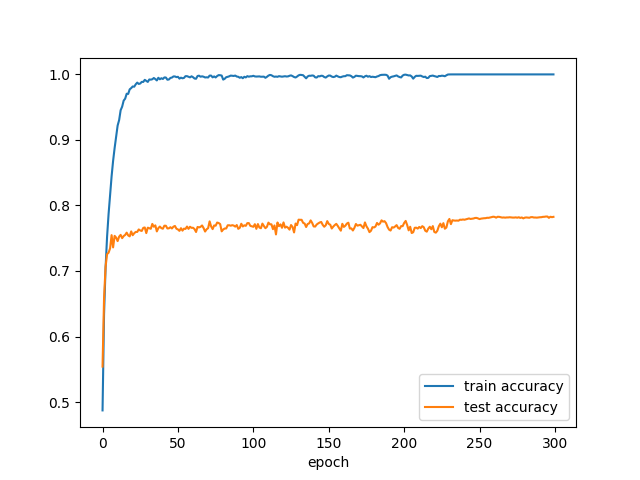

### 1. Installation

```
pip install -r requirements.txt
```

### 2. Running

#### 2.1 SGD

```
python main.py --model=...
```

... can be replaced with 

(1) lenet

(2) alexnet

(3) vggnet

(4) resnet

vggnet is vgg-11, and resnet is resnet-18

#### 2.2 SWA

```
python main.py --model=... --swa=y
```

### 3. Learning rates of SWA


### 4. Comparison with SGD(resnet-18)

SGD:



swa:

